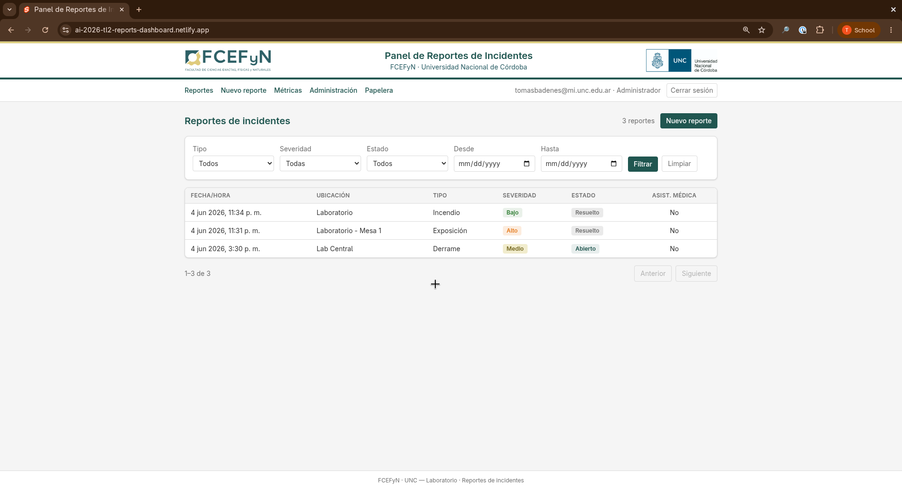
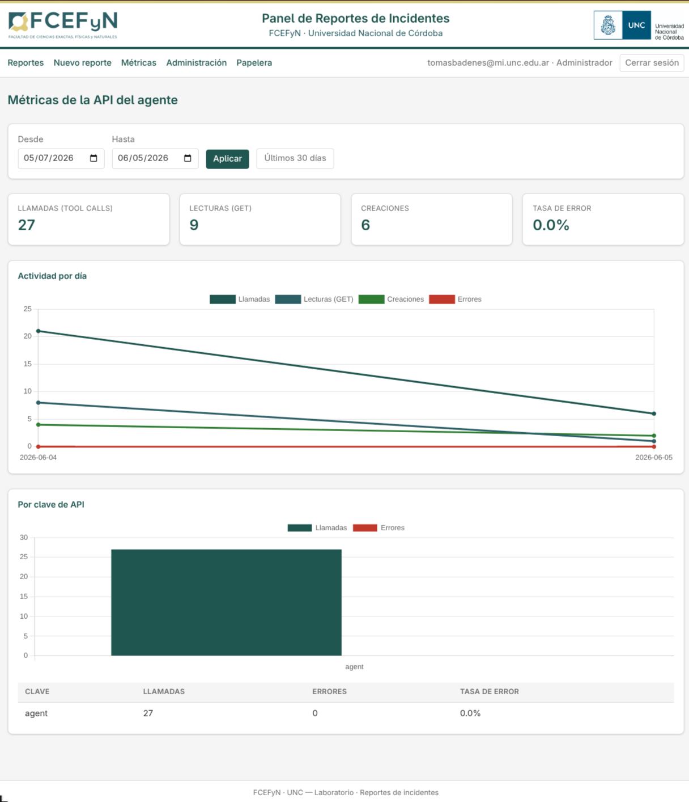

# Panel de Reportes de Incidentes - FCEFyN, UNC


[](https://ai-2026-tl2-reports-dashboard.netlify.app/)

> Group deliverable for the artificial intelligence course at FCEFyN, Universidad Nacional de Córdoba. See [`notebooks/TL2.ipynb`](notebooks/TL2.ipynb).

> [!NOTE]
>
> **AI Code disclaimer**
>
> This project uses AI-generated code

A RAG system over the UNC Safety Manual plus a LangChain agent that consumes it.
A lab worker describes an incident in plain language, the agent checks the
manual, and it files a structured report.

This repository is the service that backs that agent. It exposes the REST API
(`/api/v1`) the agent calls to create and update reports, and a dashboard where
lab staff review, filter, and manage them. Reports can come from either side:
the agent over a Bearer key, or a person through the dashboard (Google OAuth).

Live: <https://ai-2026-tl2-reports-dashboard.netlify.app/> (sign in with an
`@mi.unc.edu.ar` or `@unc.edu.ar` account).

## Demo

Reports list, with filters and pagination:



Agent API metrics, built from the `api_usage` log:



## Stack

Built with SvelteKit and TypeScript, styled with Tailwind, charts with Chart.js.
Supabase provides Postgres, auth, and the auto-generated REST layer, and the app
deploys to Netlify.

The server talks to Supabase with the service-role key for all database access.
Agents authenticate with hashed API keys; people sign in with
Google OAuth and are authorized against the `dashboard_access` allowlist.

## Routes

| Route               | Who            | Purpose                                    |
| ------------------- | -------------- | ------------------------------------------ |
| `/`                 | allowlisted    | Reports list (filters + pagination)        |
| `/incidents/{id}`   | allowlisted    | Detail; admins edit status + soft-delete   |
| `/metrics`          | allowlisted    | API-usage charts (from `api_usage`)        |
| `/admin`            | **admin**      | Allowlist + API keys (issue/revoke)        |
| `/admin/trash`      | **admin**      | Soft-deleted reports: restore / purge      |
| `/login`, `/auth/*` | public         | Google OAuth                               |
| `/api/v1/incidents` | agent (Bearer) | CRUD (see [`api.http`](api.http))          |

## Setup

```sh
npm install
cp .env.example .env   # fill in the Supabase values
npm run dev            # http://localhost:5173
```

### Environment variables

| Var                         | Notes                                           |
| --------------------------- | ----------------------------------------------- |
| `PUBLIC_SUPABASE_URL`       | Project URL (safe on client).                   |
| `PUBLIC_SUPABASE_ANON_KEY`  | Anon key (safe on client).                      |
| `SUPABASE_SERVICE_ROLE_KEY` | Server-only. Never shipped to the client.       |
| `SUPER_ADMIN_EMAIL`         | First admin, seeded on boot if no admin exists. |

Google OAuth is configured in the Supabase Auth dashboard + Google Cloud Console.

### Database

Migrations live in [`supabase/migrations`](supabase/migrations) (details in
[`supabase/README.md`](supabase/README.md)):

```sh
supabase db push        # apply to the linked project
```

### First admin

With `SUPER_ADMIN_EMAIL` set, the app seeds it on the first request. To seed
manually (no redeploy), run in the Supabase SQL editor:

```sql
select public.ensure_super_admin('you@mi.unc.edu.ar');
```

The email must match the Google account you sign in with. It only seeds when the
allowlist has no admin yet; manage further entries from `/admin`.

### Issuing an agent API key

Go to `/admin`, open **Claves de API**, and choose _Emitir clave_. The plaintext
key is shown once, so copy it. Use it as `Authorization: Bearer <key>` against
`/api/v1` (the requests in [`api.http`](api.http) are a good starting point).
Revoke from the same screen.

### Testing the API with curl

Full API contract in [PRD/SPEC.md](PRD/SPEC.md). The same flows in REST Client
format live in [`api.http`](api.http). Set the base URL and key once, then run
the commands below (`-i` shows the status line; `jq` is optional):

```sh
BASE=http://localhost:5173
KEY=REPLACE_ME
```

**Create** (`201` with the full report, including the server `id`/`created_at`):

```sh
curl -i -X POST "$BASE/api/v1/incidents" \
  -H "Authorization: Bearer $KEY" -H "Content-Type: application/json" \
  -d '{
    "timestamp": "2026-06-04T18:30:00Z",
    "location": "Laboratorio Central - Mesa 4",
    "incident_type": "DERRAME",
    "severity_level": "MEDIO",
    "chemicals_involved": [
      { "name": "Ácido Acético Glacial", "hazard_class": "Clase B y Clase E", "estimated_quantity": "250 ml" }
    ],
    "actions_taken": ["Se evacuó el área inmediata.", "Se utilizó EPP."],
    "medical_assistance_required": false,
    "status": "ABIERTO"
  }'
```

Capture the new id for the read/update/delete calls below:

```sh
ID=$(curl -s -X POST "$BASE/api/v1/incidents" \
  -H "Authorization: Bearer $KEY" -H "Content-Type: application/json" \
  -d '{"timestamp":"2026-06-04T18:30:00Z","location":"Lab Central","incident_type":"FUGA_GAS","severity_level":"ALTO","actions_taken":["Se ventiló el área."],"medical_assistance_required":true,"status":"ABIERTO"}' \
  | jq -r .id)
```

**Invalid create** (`422` with field-level `details`, here a bad enum and an empty `actions_taken`):

```sh
curl -i -X POST "$BASE/api/v1/incidents" \
  -H "Authorization: Bearer $KEY" -H "Content-Type: application/json" \
  -d '{"timestamp":"2026-06-04T18:30:00Z","location":"Lab","incident_type":"EXPLOSION","severity_level":"MEDIO","actions_taken":[],"medical_assistance_required":false,"status":"ABIERTO"}'
```

**Missing key** (`401`; still logged to `api_usage` with a null key):

```sh
curl -i "$BASE/api/v1/incidents"
```

**List** with filters and pagination (excludes soft-deleted); `from`/`to` accept a
date or a full ISO instant:

```sh
curl -s -H "Authorization: Bearer $KEY" \
  "$BASE/api/v1/incidents?status=ABIERTO&incident_type=DERRAME&limit=10&offset=0"

curl -s -H "Authorization: Bearer $KEY" \
  "$BASE/api/v1/incidents?from=2026-01-01&to=2026-12-31"
```

**Get by id** (`200`; `404` if unknown or soft-deleted):

```sh
curl -s -H "Authorization: Bearer $KEY" "$BASE/api/v1/incidents/$ID"
```

**Patch**, a partial merge that persists the status transition and bumps `updated_at`:

```sh
curl -i -X PATCH "$BASE/api/v1/incidents/$ID" \
  -H "Authorization: Bearer $KEY" -H "Content-Type: application/json" \
  -d '{"status":"EN_PROGRESO"}'
```

**Delete**, a soft delete (`204`; sets `deleted_at`, so the next GET returns `404`):

```sh
curl -i -X DELETE "$BASE/api/v1/incidents/$ID" -H "Authorization: Bearer $KEY"
```

## Develop

```sh
npm run check    # svelte-check (types)
npm run test     # vitest unit tests
npm run lint     # prettier + eslint
npm run build    # production build (adapter-netlify)
```

## Deploy (Netlify)

`netlify.toml` builds with `@sveltejs/adapter-netlify` (serverless functions, so
Supabase is reached over HTTP). Set the four env vars above in the
Netlify site settings, then deploy. After deploy, sign in with the
`SUPER_ADMIN_EMAIL` account to bootstrap the first admin.
